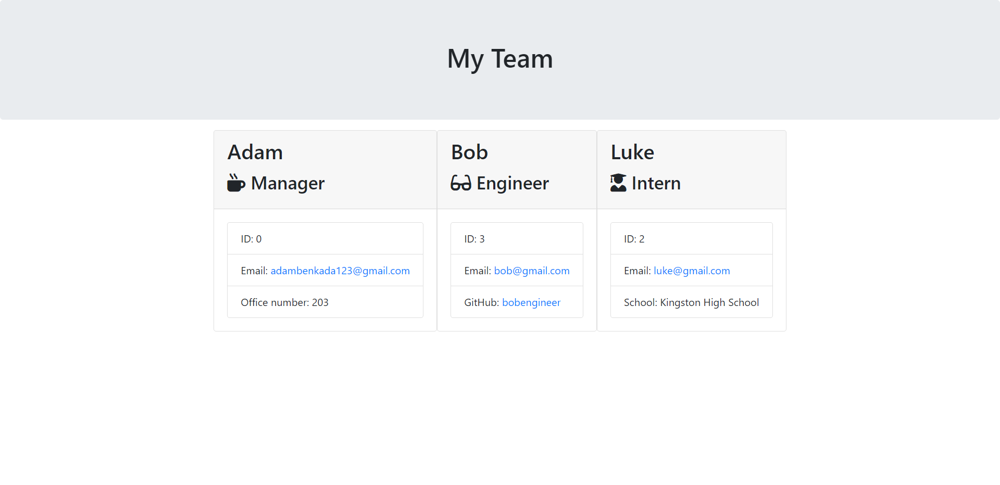

# Team-Generator

# Building a Team Profile Generator Using The Node.js Command-Line

This application takes in information about employees on a software engineering team, then generate an HTML webpage that displays summaries for each person.

## Deployed Link:

https://github.com/adammbnitro/Team-Generator

Please find the generated sample HTML file pictured below in the folder 'starter' -> 'output'

## License 

Copyright (c). All rights reserved.

Licensed under the MIT license.

